## `figure_1.1-1.txt`
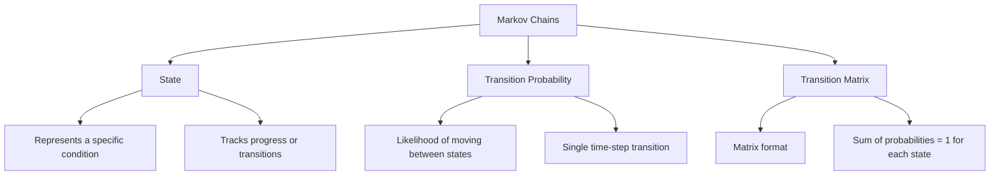

---

## `figure_1.1-2.txt`
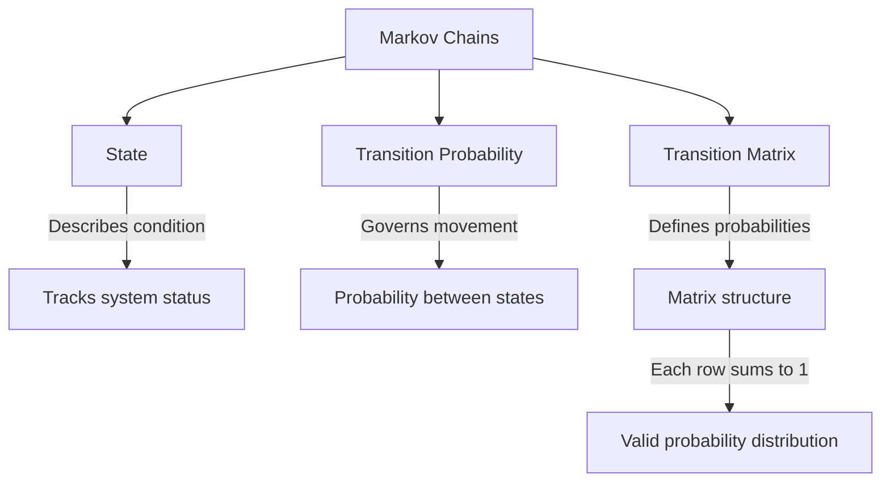

---

## `figure_1.1-3.txt`
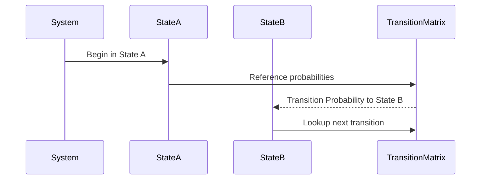

---

## `figure_2.1-1.txt`
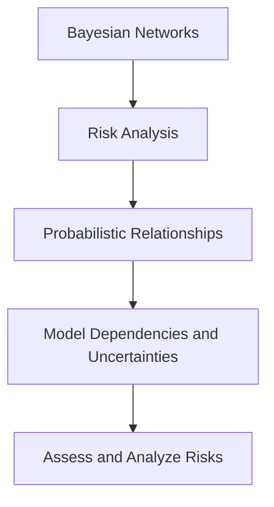

---

## `figure_2.1-2.txt`
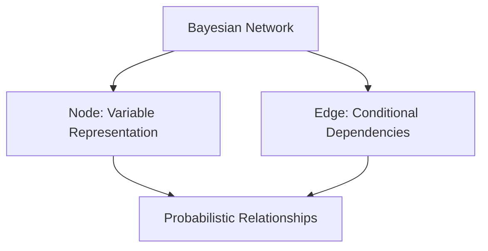

---

## `figure_2.1-3.txt`
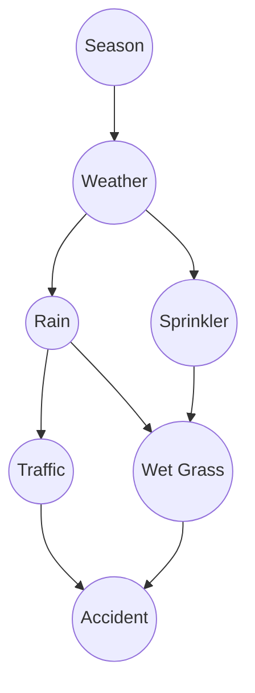

---

## `figure_3.1-1.txt`
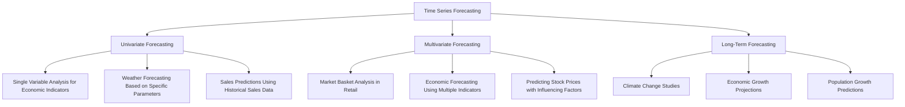

---

## `figure_3.1-2.txt`
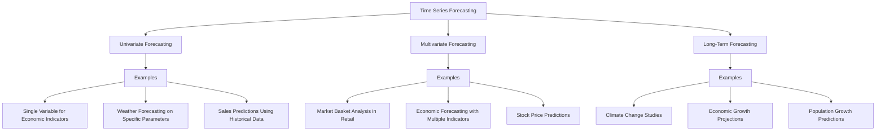

---

## `figure_3.1-3.txt`
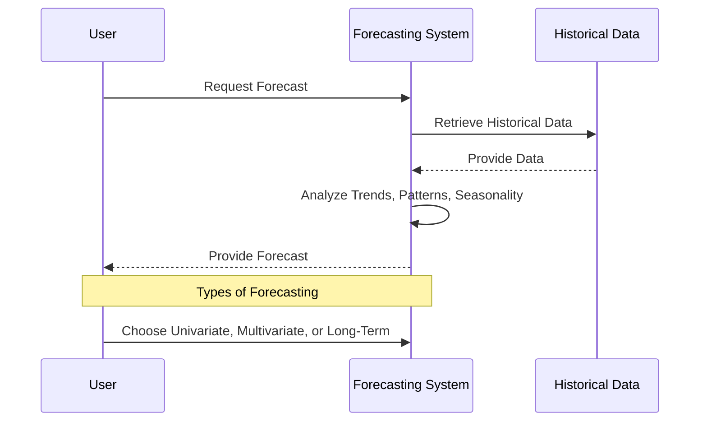

---

## `figure_3.2-1.txt`
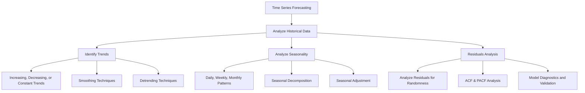

---

## `figure_3.2-2.txt`
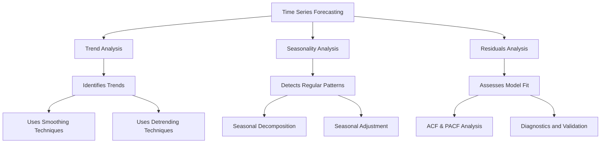

---

## `figure_3.2-3.txt`
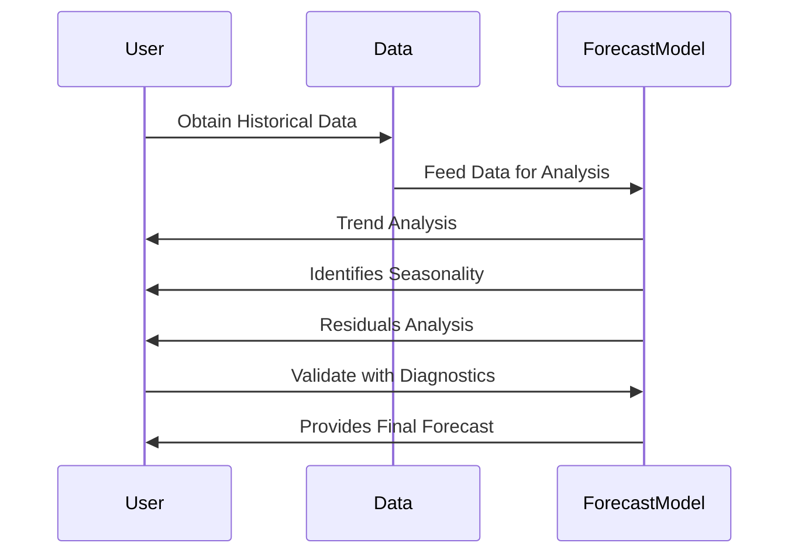

---

## `figure_4-1.txt`
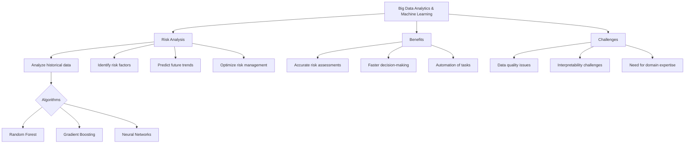

---

## `figure_4-2.txt`
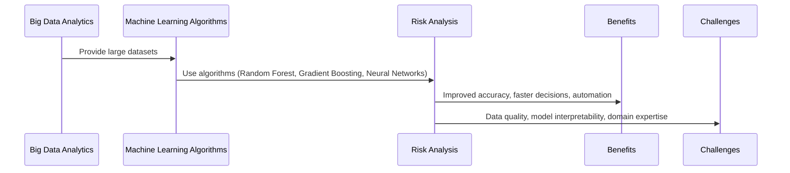

---

## `figure_4-3.txt`
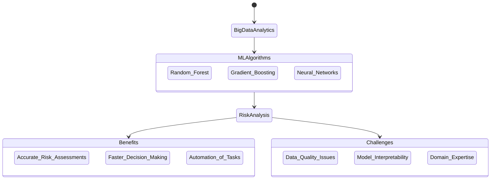
